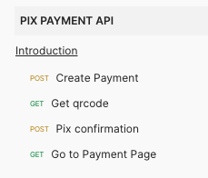
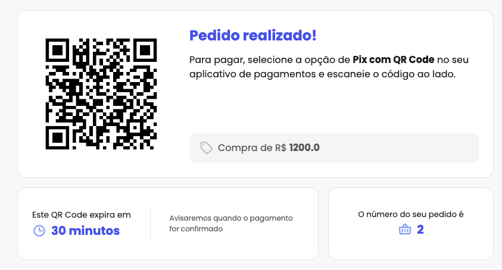
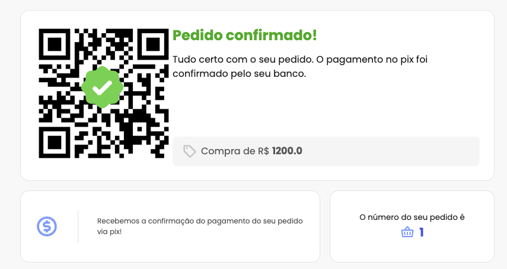
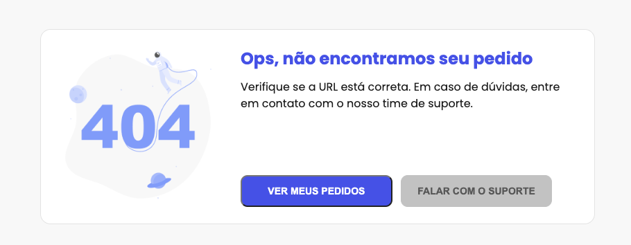

# Pix-Websocket
Application with realtime notification via websocket with Python + Flask

## Project Status
Finished 

## Installation

```sh
pip3 install -r requirements.txt
```

## Api Documentation

https://documenter.getpostman.com/view/2850031/2sA2xb7brg




## Screenshots

### Payment Created


### Payment Confirmed


### 404 Error Page


# Run Tests
Go to the tests folder and execute the file with "pytest"

```sh
pytest test_pix.py
```

# Libs

Flask
Flask SocketIO